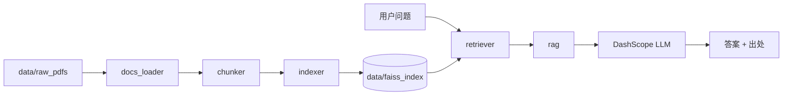

# report-rag

模拟企业内部制度知识库：基于 PDF 制度文档，实现 **解析 → 分块 → 向量检索 → 带出处回答** 的 RAG 问答系统。覆盖报销、请假、IT 支持、产品 FAQ 等场景。数据为自建可公开复现材料，非真实公司机密。

## 功能特性

- **PDF 按页解析**：保留文件名与页码，便于溯源
- **按页切分**：chunk 不跨页合并，出处精确到页
- **FAISS 向量库**：DashScope embedding 建库，支持本地持久化
- **RAG 问答**：检索 top-k 相关片段，调用通义千问生成回答
- **引用出处**：回答附带 `source` / `page`
- **拒答**：检索无结果时返回「根据现有资料无法回答」
- **CLI 入口**：`index` 建库 / `ask` 问答

## 技术栈

| 环节 | 选型 |
|------|------|
| PDF 解析 | pdfplumber |
| 文本切分 | langchain-text-splitters |
| Embedding | DashScope `text-embedding-v3` |
| 向量库 | FAISS（LangChain 封装） |
| LLM | DashScope 通义千问 `qwen-plus` |

## 架构



## 项目结构

```
report-rag/
├── main.py           # CLI 入口（index / ask）
├── docs_loader.py    # PDF 按页读取
├── chunker.py        # 文本切分
├── indexer.py        # 向量化 + FAISS 建库/加载
├── retriever.py      # 相似度检索
├── rag.py            # RAG 问答（检索 + LLM）
├── data/
│   ├── raw_pdfs/     # 示例 PDF 文档
│   └── faiss_index/  # 向量索引（运行 index 后生成，已 gitignore）
├── .env.example      # 环境变量模板
└── requirements.txt
```

## 快速开始

### 1. 环境准备

```bash
# 克隆仓库
git clone < >
cd report-rag

# 创建虚拟环境（可选）
python -m venv .venv
source .venv/bin/activate   # Windows: .venv\Scripts\activate

# 安装依赖
pip install -r requirements.txt
```

### 2. 配置 API Key

```bash
cp .env.example .env
```

编辑 `.env`，填入 [DashScope API Key](https://dashscope.console.aliyun.com/)：

```
DASHSCOPE_API_KEY=your_api_key_here
```

### 3. 建库

将 PDF 放入 `data/raw_pdfs/`（仓库已附带示例文档），然后：

```bash
python main.py index
```

输出示例：

```
共 20 页 → 45 块，开始入库…
已写入: .../data/faiss_index
```

### 4. 问答

```bash
python main.py ask "年假怎么请"
python main.py ask "出差打车怎么报销" -k 5
```

输出示例：

```
问题: 年假怎么请

（LLM 根据检索到的制度片段生成的回答）

引用出处:
  - 03_leave_policy.pdf 第1页
```

## CLI 用法

```bash
# 查看帮助
python main.py -h
python main.py index -h
python main.py ask -h

# 从指定目录建库
python main.py index --pdf-dir /path/to/pdfs

# 问答，指定检索条数
python main.py ask "餐饮报销有什么要求" -k 3
```

## 模块说明

| 模块 | 核心函数 | 说明 |
|------|----------|------|
| `docs_loader` | `load_pdfs(folder)` | 读取目录下所有 PDF，每页一条记录 |
| `chunker` | `chunk_pages(pages)` | 按页切分，保留 source/page |
| `indexer` | `build_index(chunks)` | embed + 写入 FAISS 并落盘 |
| `indexer` | `load_index()` | 从本地加载索引 |
| `retriever` | `search(query, k=3)` | 相似度检索 top-k |
| `rag` | `ask(question, k=3)` | 完整 RAG，返回 answer + sources |

各模块均可单独运行冒烟测试：

```bash
python docs_loader.py
python chunker.py
python indexer.py
python retriever.py
python rag.py
```

## 数据格式

流水线中统一使用 dict 传递，结构如下：

```python
{"source": "02_reimbursement.pdf", "page": 1, "text": "..."}
```

- `source`：来源文件名
- `page`：页码（从 1 开始）
- `text`：该页或该 chunk 的正文

页码随 metadata 写入 FAISS 的 `index.pkl`，检索时通过 `doc.metadata["page"]` 取回。

## 示例问题

仓库示例文档可尝试以下问题：

| 问题 | 预期相关文档 |
|------|-------------|
| 年假怎么请 | `03_leave_policy.pdf` |
| 出差打车怎么报销 | `02_reimbursement.pdf` |
| IT 问题找谁 | `04_it_support.pdf` |
| 产品常见问题 | `05_product_faq.pdf` |

## 设计说明

- **按页切分、不跨页**：牺牲少量上下文连贯性，换取页码出处准确
- **Prompt 约束**：要求模型仅依据参考资料回答，不足时明确拒答
- **索引与向量分离存储**：`index.faiss` 存向量，`index.pkl` 存原文与 metadata

## 注意事项

- 首次 `ask` 前必须先执行 `index` 建库
- `data/faiss_index/` 已在 `.gitignore` 中，克隆后需本地重建索引
- Embedding 与 LLM 均调用 DashScope API，会产生少量费用
- 当前拒答策略为「检索无结果」；相似度阈值拒答可作为后续优化


