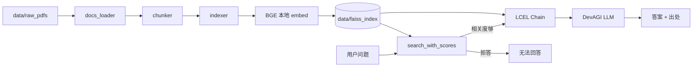

# report-rag

模拟企业内部制度知识库：基于 PDF 制度文档，实现 **解析 → 分块 → 向量检索 → 带出处回答** 的 RAG 问答系统。覆盖报销、请假、IT 支持、产品 FAQ 等场景。数据为自建可公开复现材料，非真实公司机密。

仓库地址：<https://github.com/jningc/report-rag>

## 功能特性

- **PDF 按页解析**：保留文件名与页码，便于溯源
- **按页切分**：chunk 不跨页合并，出处精确到页
- **FAISS 向量库**：本地 BGE embedding 建库，支持持久化
- **RAG 问答**：LangChain LCEL 编排检索→生成主路径，调用 LLM 生成回答
- **引用出处**：回答附带 `source` / `page`
- **拒答**：检索无结果或相关度过低时不调用 LLM
- **检索层测评**：8 条固定用例自动验证命中与拒答
- **CLI 入口**：`index` 建库 / `ask` 问答 / `eval` 测评
- **Web 界面**：Streamlit 浏览器问答，侧边栏可调 top-k、一键试示例问题

## 技术栈

| 环节 | 选型 |
|------|------|
| PDF 解析 | pdfplumber |
| 文本切分 | langchain-text-splitters |
| Embedding | 本地 `BAAI/bge-small-zh-v1.5`（sentence-transformers） |
| 向量库 | FAISS（LangChain 封装） |
| LLM | DevAGI OpenAI 兼容 API（默认 `gpt-3.5-turbo`） |
| RAG 编排 | LangChain LCEL（`retriever \| format_docs \| prompt \| llm`） |
| Web UI | Streamlit（`app.py`） |

Embedding 在本地运行，**建库与检索无需 API Key**；`ask` 仅 LLM 调用需要 DevAGI Key。

## 架构



## 项目结构

```
report-rag/
├── main.py              # CLI 入口（index / ask / eval）
├── app.py               # Streamlit Web 问答界面
├── docs_loader.py       # PDF 按页读取
├── chunker.py           # 文本切分
├── indexer.py           # 向量化 + FAISS 建库/加载
├── retriever.py         # 相似度检索 + get_retriever（LangChain 接口）
├── rag.py               # RAG 问答（LCEL Chain + ask）
├── eval.py              # 检索层测评
├── data/
│   ├── raw_pdfs/        # 示例 PDF 文档
│   ├── eval_cases.json  # 测评用例
│   └── faiss_index/     # 向量索引（运行 index 后生成，已 gitignore）
├── .env.example
└── requirements.txt
```

## 快速开始

### 1. 环境准备

```bash
git clone https://github.com/jningc/report-rag
cd report-rag

python -m venv .venv
source .venv/bin/activate   # Windows: .venv\Scripts\activate

pip install -r requirements.txt
```

首次建库会从 HuggingFace 下载 BGE 模型（约几百 MB）。网络不稳时可设镜像：

```bash
export HF_ENDPOINT=https://hf-mirror.com
```

### 2. 配置 LLM Key（仅 ask 需要）

```bash
cp .env.example .env
```

编辑 `.env`，填入 [DevAGI](https://devcto.com) 的 Key 与端点：

```
DEVAGI_API_KEY=your_devagi_api_key_here
DEVAGI_BASE_URL=https://api.fe8.cn/v1
DEVAGI_MODEL=gpt-3.5-turbo
```

`index` 与 `eval` 不调用 LLM，可不配置 Key（Embedding 为本地 BGE）。

### 3. 建库

PDF 已放在 `data/raw_pdfs/`，执行：

```bash
python main.py index
```

输出示例：

```
共 32 页 → 308 块，开始入库…
已写入: .../data/faiss_index
```

### 4. 问答

```bash
python main.py ask "年假怎么请"
python main.py ask "出差打车怎么报销" -k 5
```

### 5. 检索层测评

```bash
python main.py eval
```

### 6. Web 界面（Streamlit）

建库并配置好 `.env` 后，启动浏览器问答：

```bash
streamlit run app.py
```

默认地址：<http://localhost:8501>。界面支持输入问题、调节检索条数（top-k），侧边栏提供示例问题一键提问；回答与 CLI 一致，附带引用出处。

首次运行 Streamlit 可能在终端询问邮箱，直接按 Enter 跳过即可。

## CLI 用法

```bash
python main.py -h
python main.py index -h
python main.py ask -h
python main.py eval -h

python main.py index --pdf-dir /path/to/pdfs
python main.py ask "餐饮报销有什么要求" -k 3
python main.py eval -k 5
python eval.py
```

## Web 界面

```bash
streamlit run app.py
```

| 功能 | 说明 |
|------|------|
| 问题输入 | 主区域文本框 +「提问」按钮 |
| 检索条数 | 侧边栏 slider 调节 top-k（1–10） |
| 示例问题 | 侧边栏一键填入并提问 |
| 索引检查 | 未建库时页面提示执行 `python main.py index` |

底层复用 `rag.ask()`，需配置 `DEVAGI_API_KEY`。

## RAG 主路径（LangChain LCEL）

`ask()` 对外接口不变，内部生成部分已改为 LangChain LCEL Chain：

```
ask(question)
  ├─ search_with_scores     # 拒答判断 + 提取 sources（不调 LLM）
  └─ chain.invoke(question) # LCEL 生成主路径
       retriever | format_docs  →  context
       RunnablePassthrough()    →  question
       | RAG_PROMPT | llm | StrOutputParser()
```

核心函数：

| 函数 | 说明 |
|------|------|
| `get_retriever(k)` | FAISS → LangChain Retriever |
| `format_docs(docs)` | Document 列表 → prompt 参考资料字符串 |
| `build_rag_chain(retriever, llm)` | 组装 LCEL 管道 |
| `ask(question, k)` | 拒答 + `chain.invoke` + 返回 sources |

## 模块说明

| 模块 | 核心函数 | 说明 |
|------|----------|------|
| `docs_loader` | `load_pdfs(folder)` | 读取目录下所有 PDF，每页一条记录 |
| `chunker` | `chunk_pages(pages)` | 按页切分，保留 source/page |
| `indexer` | `build_index(chunks)` | BGE embed + 写入 FAISS 并落盘 |
| `indexer` | `load_index()` | 从本地加载索引 |
| `retriever` | `search(query, k=3)` | 相似度检索 top-k（vectorstore 进程内缓存） |
| `retriever` | `search_with_scores(query, k=3)` | 带相关度分数的检索，供拒答判断 |
| `retriever` | `get_retriever(k=3)` | 返回 LangChain Retriever，供 LCEL 使用 |
| `rag` | `build_rag_chain(retriever, llm)` | LCEL：检索 → prompt → LLM |
| `rag` | `ask(question, k=3)` | 完整 RAG，返回 answer + sources |
| `eval` | `run_eval(k=3)` | 检索层测评，不调 LLM |

各模块均可单独冒烟：

```bash
python docs_loader.py
python chunker.py
python indexer.py
python retriever.py
python rag.py
python eval.py
```

## 数据格式

流水线中统一使用 dict 传递：

```python
{"source": "02_reimbursement.pdf", "page": 1, "text": "..."}
```

页码随 metadata 写入 FAISS 的 `index.pkl`，检索时通过 `doc.metadata["page"]` 取回。

## 示例问题

| 问题 | 预期相关文档 |
|------|-------------|
| 年假怎么请 | `03_leave_policy.pdf` |
| 出差打车怎么报销 | `02_reimbursement.pdf` |
| IT 问题找谁 | `04_it_support.pdf` |
| 产品常见问题 | `05_product_faq.pdf` |

## 测评

检索层自动测评（见 `data/eval_cases.json`），验证 **source 命中** 与 **相似度拒答**，与 `rag.py` 共用 `MIN_RELEVANCE_SCORE`，不调用 LLM。

| 用例类型 | 通过条件 |
|----------|----------|
| 正常问题 | top-k 命中预期 PDF，且最高相关度 >= 阈值 |
| 应拒答问题 | 无结果，或最高相关度 < 阈值 |

阈值在 `rag.py` 的 `MIN_RELEVANCE_SCORE`（当前默认 `0.4`），换 embedding 模型后可能需要微调。

## 设计说明

- **按页切分、不跨页**：保证页码出处准确
- **本地 BGE + 云端 LLM**：建库/检索零 API 费用，仅生成答案消耗 LLM 额度
- **LangChain LCEL 主路径**：`retriever | format_docs | prompt | llm` 标准编排检索→生成
- **拒答前置**：`search_with_scores` 判定相关度，不足时不构建 Chain、不调用 LLM
- **retriever 缓存**：同一进程内多次检索只加载 BGE/FAISS 一次

## 注意事项

- 首次 `ask` / `eval` / Web 界面前须先 `python main.py index`
- 更换 embedding 模型后须删除 `data/faiss_index/` 并重建索引
- `data/faiss_index/` 已在 `.gitignore`，克隆后需本地建库
- DashScope 方案在 `indexer.py` / `rag.py` 中以注释保留，可切换回通义千问
